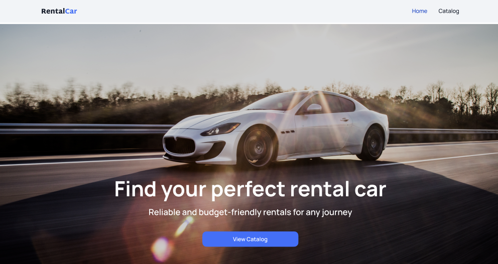

<h1 align="center">🚗 Car Rental App</h1>
<p align="center">A modern web application for browsing, filtering and booking rental cars</p>

---

## 📌 Description

A web application for browsing and booking rental cars. Users can filter cars by brand, price, and
mileage, view detailed information, and submit booking requests.

## 🔗 Preview

<p align="center">
  
</p>

[Live Demo](https://rental-car-phi-ashen.vercel.app)
[GitHub Repository](https://github.com/LiliiaDud/rental-car)

## ⚙️ Features

- Filter cars by:
  - Brand
  - Rental price
  - Mileage
- Detailed car information page
- Infinite pagination with **Load More**
- Booking form with validation (Yup)
- Global state with Zustand
- Data fetching & caching with TanStack Query

## 🛠️ Tech Stack

- **Next.js (App Router)**
- **React**
- **TypeScript**
- **TanStack React Query**
- **Axios**
- **Zustand**
- **Yup**
- **React DatePicker**
- **CSS Modules**

## 🚀 Installation

```bash
git clone https://github.com/LiliiaDud/rental-car.git
cd rental-car
npm install
npm run dev
```

## 🌐 Environment variables

Create .env.local:

```bash
NEXT_PUBLIC_API_URL=your_api_url
```

## ▶️ Usage

- Navigate to /catalog
- Apply filters to find suitable cars
- Click a car to view details
- Submit a booking request

### Author

**liliia Dudnyk** [@Liliia Dudnyk](https://github.com/LiliiaDud)  
 Fullstack Developer
